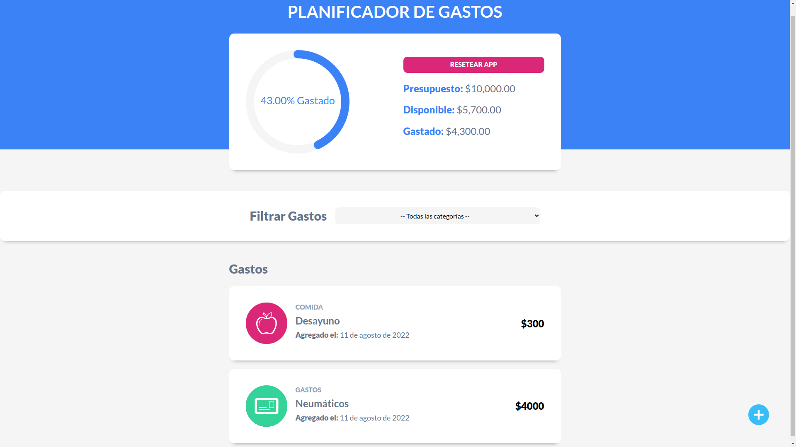

# Título del Proyecto

Planificador de Gastos

## Description

Aplicación desarrollada con React que permite ingresar un monto inicial e ir descontando de dicho monto los gastos realizados. Dichos gastos se visualizan por categoría y cada gasto se ve reflejado en un gráfico circular que indica el presupuesto restante.

Funcionalidades:

1. Agregar monto inicial.
2. Modal para agregar gastos.
3. Filtro para mostrar gastos de una categoría
4. Botón para resetear presupuesto.

## Getting Started

### Dependencies

prop-types: ^15.8.1  

react: "^17.0.2"  

react-circular-progressbar: ^2.0.4  

react-dom: ^17.0.2  

react-swipeable-list: ^1.5.0  

### Installing

- npm install

### Executing program

- npm run dev

## Authors

- Eduardo Daniel Viana
- Email: eduardoviana83@gmail.com
- Url: [https://eduviana.github.io/Control-de-Gastos/](https://eduviana.github.io/Control-de-Gastos/)
